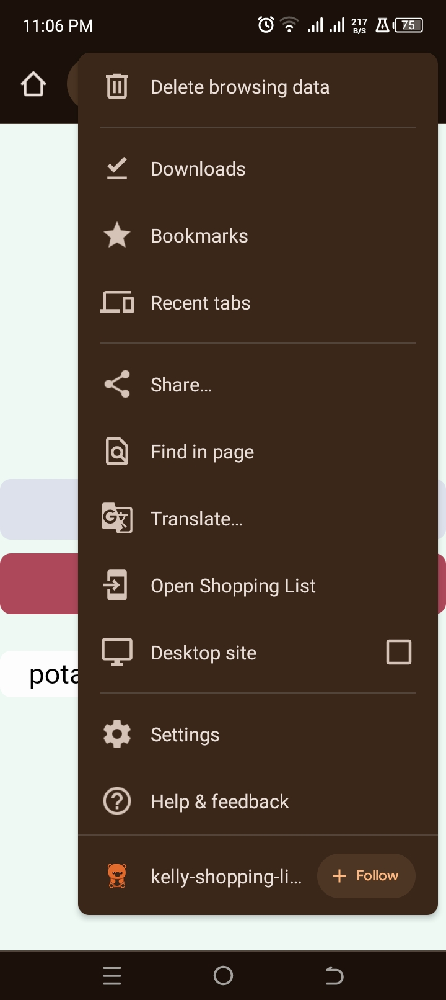
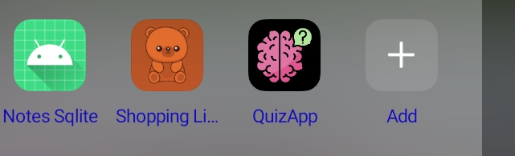
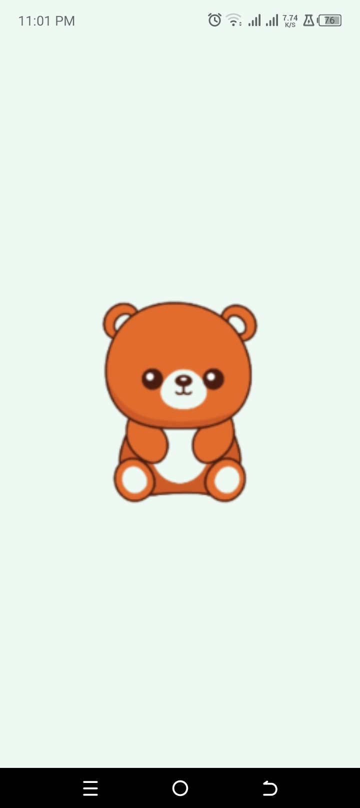
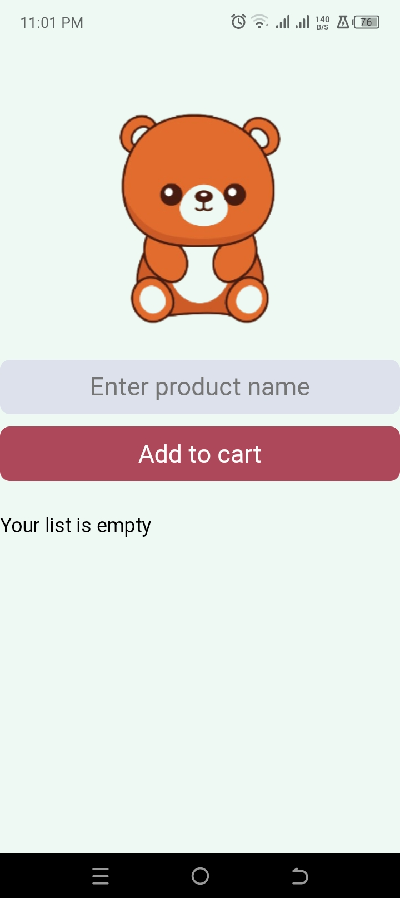
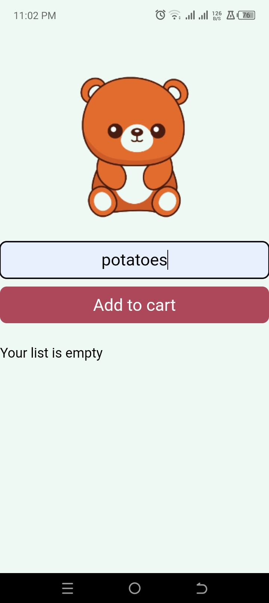
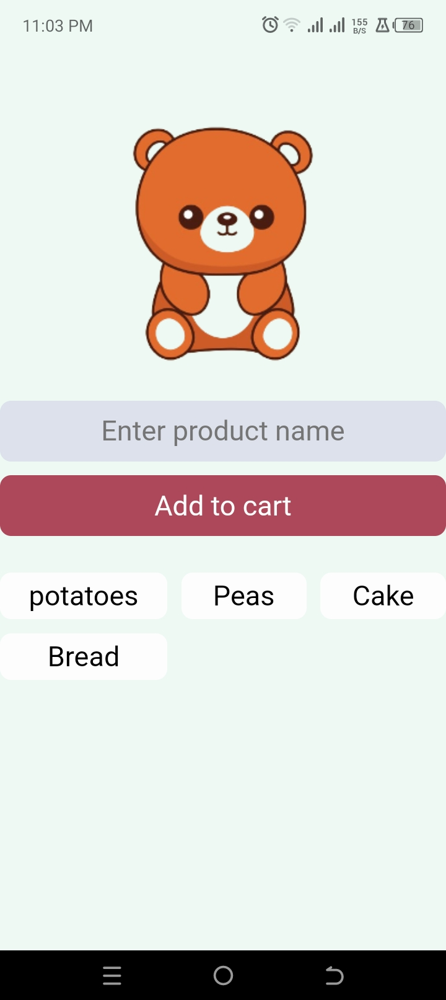
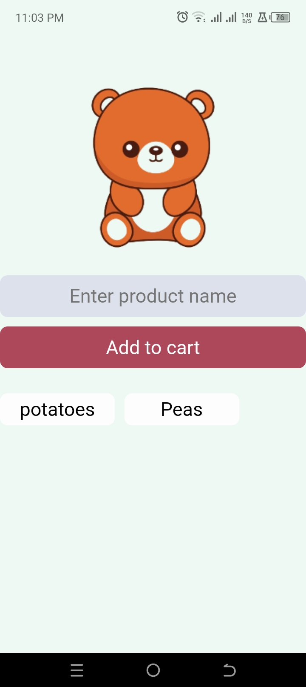

Shopping List Web App

### intro
This is a simple and intuitive shopping list web application built with vanilla JavaScript and Firebase. The app allows users to manage their shopping lists by adding and removing items, with data being stored and synced via Firebase Realtime Database. The app can also be installed directly from Chrome as a Progressive Web App (PWA) for easy access.

## Screenshots

### Installation from chrome

1. Navigate to website
   [Link Here]([URL](https://kelly-shopping-list.netlify.app/))

##

3. install

- Click on the ellipsis icon on the top right of your screen and navigate to the install button and click to install.

### it installs as a native app

### welcome Screen

### empty cart view

### adding to cart view

### view with cart items added

### removing item from cart
- click on item to removing it from cart

## Features
  Add Items to the List: Users can input items into the shopping list using the input field and add them by clicking the "Add" button.
  Remove Items from the List: Items can be removed from the list by clicking on them.
  Persistent Storage with Firebase: The app uses Firebase Realtime Database to store and sync the shopping list, ensuring that the data is always available, even after closing and reopening the app.
  Progressive Web App (PWA): The app can be installed directly from Chrome for a native app-like experience.
## Installation
  To get the app up and running locally or on your server, follow these steps:

1. Clone the Repository:

    bash
    Copy code
    git clone https://github.com/your-username/shopping-list-app.git
    cd shopping-list-app
    Set Up Firebase:

Go to Firebase Console and create a new project.
In the Firebase Console, add a new Web App to your project.
Copy the Firebase configuration provided and replace the databaseURL in the appSettings object in the app.js file.
Run the App:

Simply open the index.html file in your browser to start using the app.
Usage
Add a Shopping List Item: Enter the name of the item in the input field and click the "Add" button. The item will be added to your list and saved in the Firebase Realtime Database.
Remove a Shopping List Item: Click on an item in the list to remove it. This will delete the item from both the UI and the Firebase database.
Code Overview
app.js
This JavaScript file contains all the logic for the app:

Firebase Initialization:

The app is initialized using Firebase, and the Realtime Database is set up to store and retrieve shopping list items.
javascript
Copy code
import { initializeApp } from "https://www.gstatic.com/firebasejs/9.14.0/firebase-app.js";
import { getDatabase, ref, onValue, push, remove } from "https://www.gstatic.com/firebasejs/9.14.0/firebase-database.js";

const appSettings = {
    databaseURL: 'https://your-firebase-database-url.firebaseio.com/'
}

const app = initializeApp(appSettings);
const database = getDatabase(app);
const shoppingListInDB = ref(database, 'shoppingList');
Event Listeners and DOM Manipulation:

The app listens for user input to add items and interacts with Firebase to store and retrieve data. It also handles clearing the input field and updating the shopping list UI.
javascript
Copy code
addButton.addEventListener('click', () => {
    const inputValue = cartValue.value;
    push(shoppingListInDB, inputValue);
    clearInput();
    counter.classList.add('active')
});
Firebase Data Syncing:

The app listens to changes in the Firebase database and updates the shopping list accordingly. It also handles removing items from the list.
javascript
Copy code
onValue(shoppingListInDB, (snapshot) => {
    if (snapshot.exists()) {
        let itemsArray = Object.entries(snapshot.val());

        clearShoppingList();
        for (let i = 0; i < itemsArray.length; i++) {
            let currentItem = itemsArray[i];
            let currentItemId = currentItem[0];
            appendToShoppingList(currentItem);
        }
    } else {
        shoppingList.innerHTML = 'Your list is empty';
    }
});
Helper Functions:

These functions help manage the app’s UI by clearing input fields, clearing the shopping list, and appending items to the list.
javascript
Copy code
const clearInput = () => {
    cartValue.value = '';
};

const clearShoppingList = () => {
    shoppingList.innerHTML = '';
};

function appendToShoppingList(item) {
    let itemID = item[0];
    let itemValue = item[1];
    let newEl = document.createElement('li');
    newEl.textContent = itemValue;
    newEl.id = itemID;
    newEl.addEventListener('click', () => {
        let exactLocationInDB = ref(database, `shoppingList/${itemID}`);
        remove(exactLocationInDB);
    });
    shoppingList.append(newEl);
}
index.html
This file contains the HTML structure of the app, including the input field, add button, and the shopping list display area.

style.css
The CSS file is responsible for styling the app's UI, ensuring it looks clean and responsive.

Contributing
If you’d like to contribute to the project, please fork the repository and submit a pull request with your changes. Contributions are always welcome!

License
This project is licensed under the MIT License. See the LICENSE file for more details.

Acknowledgements
Firebase for providing the backend services.
Google Chrome for the PWA features.
